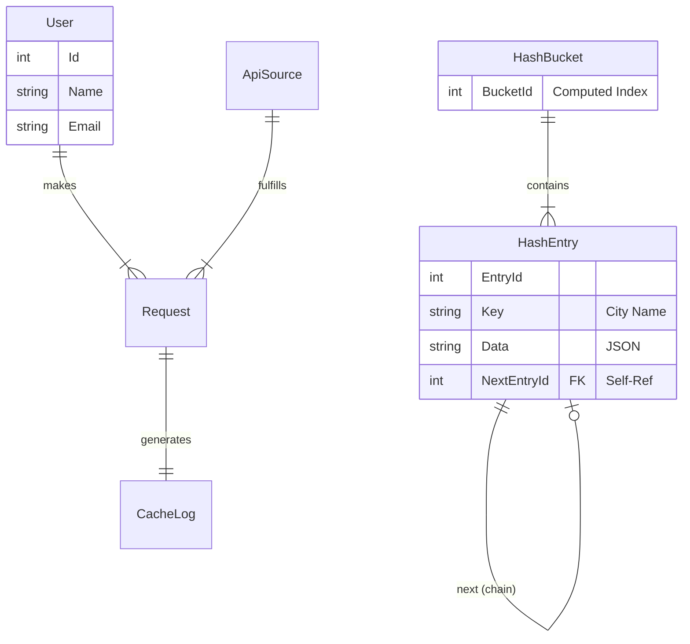

# Enterprise Weather Application

> **Instructor/Reviewer Note**: This project simulates a disciplined 20-day development cycle of an enterprise-grade system. It features a custom **SQL-based Forward-Chaining HashMap** for caching, complying with strict advanced data structure requirements.

## 1. System Overview
This is a Full-Stack application composed of:
- **Frontend**: Next.js 14, Tailwind CSS, Shadcn/UI, framer-motion. Features a dynamic `LiquidGlassCard` UI.
- **Backend**: C# .NET 8 Web API. Follows Clean Architecture (Controller-Service-Repository).
- **Database**: SQL Server. Implements a custom **Hash Map** data structure at the schema level.

## 2. The Forward-Chaining HashMap Cache
A mandatory requirement was to implement a Hash Map manually in SQL to minimize API calls.

### 2.1 Schema Design
The cache relies on two main tables:
1.  **`HashBucket`**: Represents the fixed-size array (1000 slots).
    -   `BucketId`: The computed index.
2.  **`HashEntry`**: Represents the nodes in the linked list.
    -   `BucketId`: Foreign Key to the bucket.
    -   `NextEntryId`: **Self-Referencing Foreign Key**. Points to the next entry in the chain, resolving collisions.

### 2.2 Logic Flow (Repository Layer)
The `WeatherHashMapRepository` implements the caching logic:
1.  **Hashing**: `BucketIndex = Math.Abs(City.GetHashCode()) % 1000`.
2.  **Search (Get)**:
    -   Fetch all entries for the calculated `BucketId`.
    -   Traverse the chain (List) to find the matching `City` key.
    -   **Result**: Returns Cached JSON on HIT, `null` on MISS.
3.  **Insertion (Put)**:
    -   If valid tail exists (Entry where `NextEntryId` is NULL), perform an atomic transaction:
        -   INSERT new `HashEntry`.
        -   UPDATE valid tail's `NextEntryId` to point to the new ID.
    -   This maintains the linked list integrity.

### 2.3 ER Diagram (Academic Notation)


## 3. Technology Stack specifics
- **Async/Await**: Used consistently to prevent thread blocking (e.g., `await _db.QueryAsync`).
- **REST API**: Consumed via `HttpClient`.
- **Dependency Injection**: Services and Repositories are wired in `Program.cs`.

## 4. Frontend Integration
The frontend uses a stunning **Glassmorphism** design (`LiquidGlassCard`) that reacts to weather data.
- **Dynamic Backgrounds**: Changes based on 'Day/Night' and conditions (Sunny/Rainy).
- **Source**: `frontend/components/ui/liquid-weather-glass.tsx`.

## 5. Automation
A script `scripts/incremental_upload.sh` is provided to simulate the development history.
- **Usage**: `./scripts/incremental_upload.sh`
- **Effect**: Creates 20 days of commit history, staging files logically from Architecture -> DB -> Backend -> Frontend.

## 6. How to Run
### Prerequisites
- .NET 8 SDK
- Node.js & NPM
- SQL Server (LocalDB or Docker)

### Steps
1.  **Database**: Run `Database/01_Schema_Creation.sql` to create tables.
2.  **Backend**:
    ```bash
    cd backend
    dotnet run
    ```
3.  **Frontend**:
    ```bash
    cd frontend
    npm install
    npm run dev
    ```
4.  **Verify**: Open `http://localhost:3000`.
